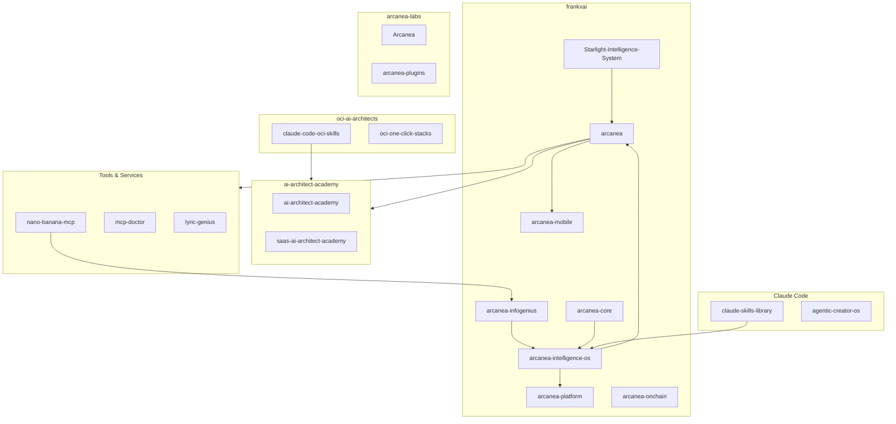
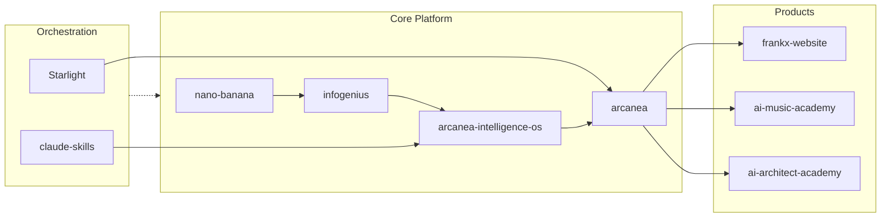
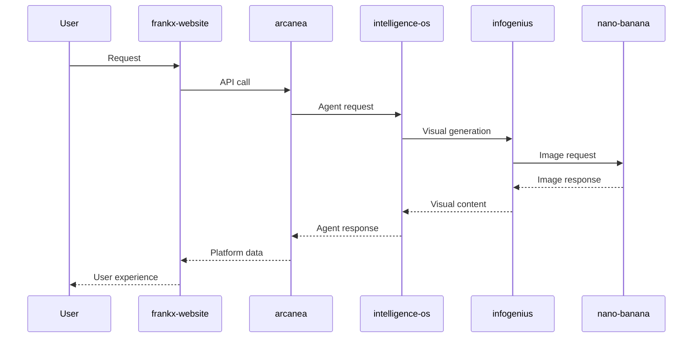
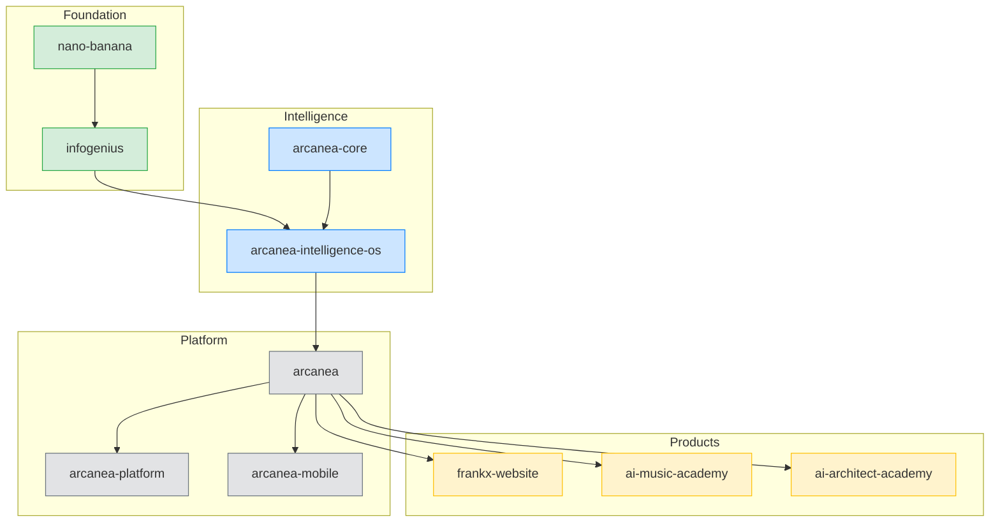
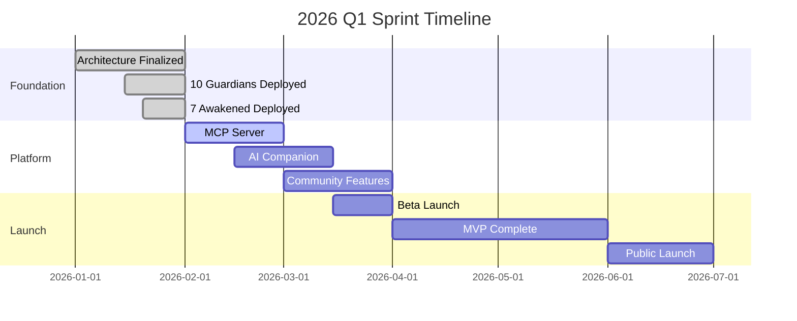
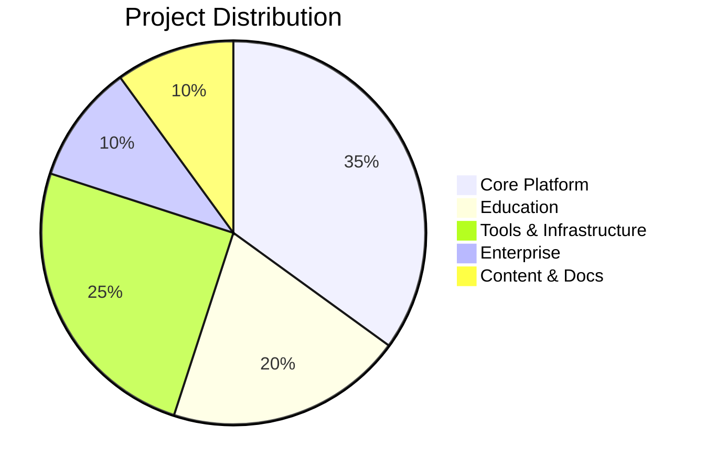

# Architecture Diagram

> Visual representation of the FrankX OS ecosystem

```mermaid
flowchart TB
    subgraph ORG1["frankxai"]
        direction TB
        A1[arcanea]
        A2[arcanea-platform]
        A3[arcanea-mobile]
        A4[arcanea-intelligence-os]
        A5[arcanea-core]
        A6[arcanea-infogenius]
        A7[arcanea-onchain]
        A8[Starlight-Intelligence-System]
    end

    subgraph ORG2["ai-architect-academy"]
        B1[ai-architect-academy]
        B2[saas-ai-architect-academy]
    end

    subgraph ORG3["arcanea-labs"]
        C1[Arcanea]
        C2[arcanea-plugins]
    end

    subgraph ORG4["oci-ai-architects"]
        D1[claude-code-oci-skills]
        D2[oci-one-click-stacks]
    end

    subgraph TOOLS["Tools & Services"]
        T1[nano-banana-mcp]
        T2[mcp-doctor]
        T3[lyric-genius]
    end

    subgraph SKILLS["Claude Code"]
        S1[claude-skills-library]
        S2[agentic-creator-os]
    end

    T1 --> A6
    A6 --> A4
    A5 --> A4
    S1 --> A4
    A4 --> A1
    A4 --> A2
    A8 --> A1
    A1 --> A3
    A1 --> ORG2
    A1 --> TOOLS
    D1 --> ORG2
```

---

```mermaid
flowchart LR
    subgraph CORE["Core Platform"]
        NB[nano-banana] --> IG[infogenius]
        IG --> AIO[arcanea-intelligence-os]
        AIO --> ARC[arcanea]
    end

    subgraph ORCHESTRATION["Orchestration"]
        ST[Starlight] --> ARC
        CS[claude-skills] --> AIO
    end

    subgraph PRODUCTS["Products"]
        ARC --> FW[frankx-website]
        ARC --> AMA[ai-music-academy]
        ARC --> AAA[ai-architect-academy]
    end

    ORCHESTRATION -.-> CORE
```

---

## Data Flow

```mermaid
sequenceDiagram
    participant U as User
    participant W as frankx-website
    participant A as arcanea
    participant AI as intelligence-os
    participant IG as infogenius
    participant NB as nano-banana

    U->>W: Request
    W->>A: API call
    A->>AI: Agent request
    AI->>IG: Visual generation
    IG->>NB: Image request
    NB-->>IG: Image response
    IG-->>AI: Visual content
    AI-->>A: Agent response
    A-->>W: Platform data
    W-->>U: User experience
```

---

## Repository Dependencies

```mermaid
graph TD
    subgraph Foundation
        NC[nano-banana]:::green
        IG[infogenius]:::green
    end

    subgraph Intelligence
        AC[arcanea-core]:::blue
        AIOS[arcanea-intelligence-os]:::blue
    end

    subgraph Platform
        AR[arcanea]:::purple
        AP[arcanea-platform]:::purple
        AM[arcanea-mobile]:::purple
    end

    subgraph Products
        FW[frankx-website]:::orange
        AMA[ai-music-academy]:::orange
        AAA[ai-architect-academy]:::orange
    end

    NC --> IG
    IG --> AIOS
    AC --> AIOS
    AIOS --> AR
    AR --> AP
    AR --> AM
    AR --> FW
    AR --> AMA
    AR --> AAA

    classDef green fill:#d4edda,stroke:#28a745
    classDef blue fill:#cce5ff,stroke:#007bff
    classDef purple fill:#e2e3e5,stroke:#6c757d
    classDef orange fill:#fff3cd,stroke:#ffc107
```

---

## Sprint Velocity

```mermaid
gantt
    title 2026 Q1 Sprint Timeline
    dateFormat  YYYY-MM-DD
    section Foundation
    Architecture Finalized   :done,    des1, 2026-01-01, 2026-02-01
    10 Guardians Deployed     :done,    des2, 2026-01-15, 2026-02-01
    7 Awakened Deployed      :done,    des3, 2026-01-20, 2026-02-01
    section Platform
    MCP Server               :active,  des4, 2026-02-01, 2026-03-01
    AI Companion            :         des5, 2026-02-15, 2026-03-15
    Community Features      :         des6, 2026-03-01, 2026-04-01
    section Launch
    Beta Launch             :         des7, 2026-03-15, 2026-04-01
    MVP Complete            :         des8, 2026-04-01, 2026-06-01
    Public Launch           :         des9, 2026-06-01, 2026-07-01
```

---

## Milestone Tracker

```mermaid
pie title Project Distribution
    "Core Platform" : 35
    "Education" : 20
    "Tools & Infrastructure" : 25
    "Enterprise" : 10
    "Content & Docs" : 10
```
